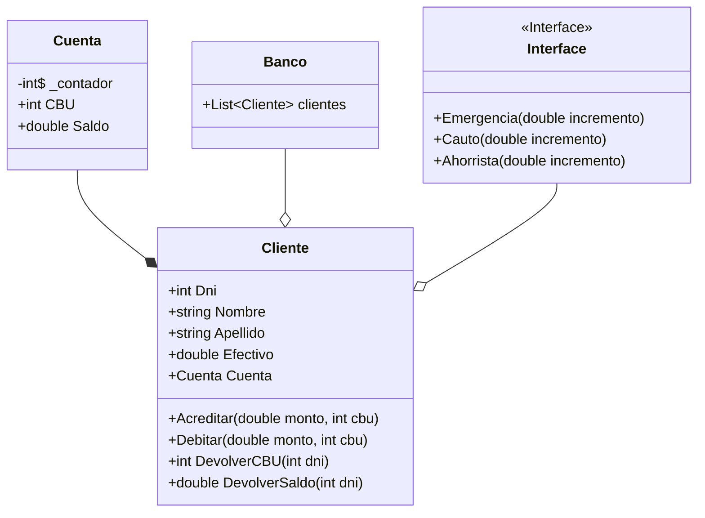

# Banco
Trabajo para Duran

```mermaid

classDiagram
direction lr

class Cliente{
    +int Dni
    +string Nombre
    +string Apellido
    +double Efectivo
    +Cuenta Cuenta

    +Acreditar(double monto, int cbu)
    +Debitar(double monto, int cbu)
    +int DevolverCBU(int dni)
    +double DevolverSaldo(int dni)
}

class Cuenta{
    -int$ _contador
    +int CBU
    +double Saldo
}

class Banco{
    +List~Cliente~ clientes
}

class Interface{
    <<Interface>>
    +Emergencia(double incremento)
    +Cauto(double incremento)
    +Ahorrista(double incremento)
}

Cuenta --* Cliente
Banco --o Cliente
Interface --o Cliente

```