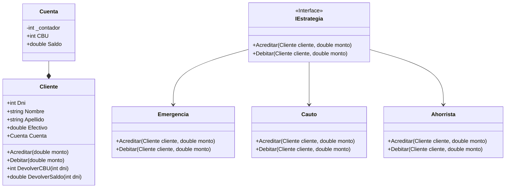

# Banco
Trabajo para Duran

```mermaid

classDiagram
direction lr

class Cliente{
    +int Dni
    +string Nombre
    +string Apellido
    +double Efectivo
    +Cuenta Cuenta

    +Acreditar(double monto)
    +Debitar(double monto)
    +int DevolverCBU(int dni)
    +double DevolverSaldo(int dni)
}

class Cuenta{
    -int _contador
    +int CBU
    +double Saldo
}

class Emergencia{
    +Acreditar(Cliente cliente, double monto)
    +Debitar(Cliente cliente, double monto)
}

class Cauto{
    +Acreditar(Cliente cliente, double monto)
    +Debitar(Cliente cliente, double monto)
}

class Ahorrista{
    +Acreditar(Cliente cliente, double monto)
    +Debitar(Cliente cliente, double monto)
}

class IEstrategia{
    <<Interface>>
    +Acreditar(Cliente cliente, double monto)
    +Debitar(Cliente cliente, double monto)
}

Cuenta --* Cliente
IEstrategia --> Emergencia
IEstrategia --> Cauto
IEstrategia --> Ahorrista

```