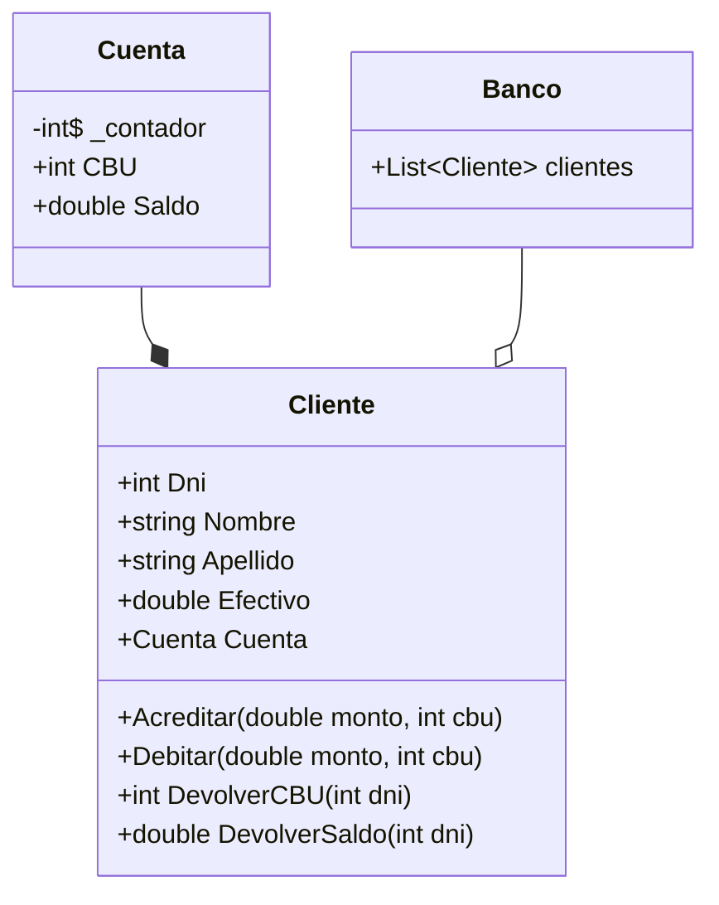

# Banco
Trabajo para el profesor Duran de progreso de redes

```mermaid

classDiagram
direction lr

class Cliente{
    +int Dni
    +string Nombre
    +string Apellido
    +double Efectivo
    +Cuenta Cuenta

    +Acreditar(double monto, int cbu)
    +Debitar(double monto, int cbu)
    +int DevolverCBU(int dni)
    +double DevolverSaldo(int dni)
}

class Cuenta{
    -int$ _contador
    +int CBU
    +double Saldo
}

class Banco{
    +List~Cliente~ clientes
}

Cuenta --* Cliente
Banco --o Cliente

```
